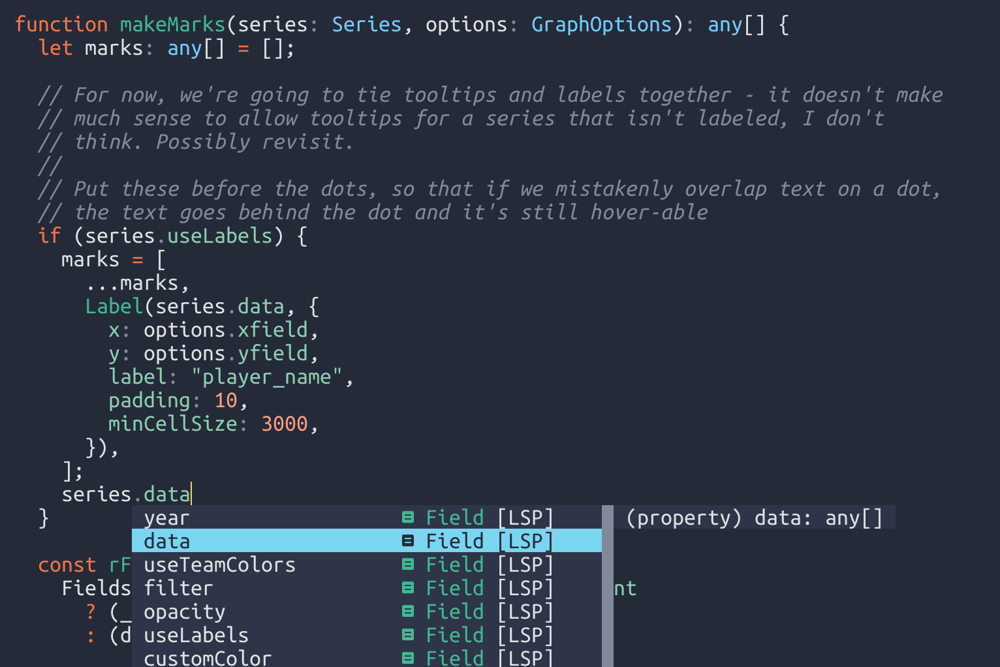

# Lilium

My personal color scheme, based off of [Sonokai](https://github.com/sainnhe/sonokai)

## Statusline status

I don't use lualine, airline or lightline but I think they should work if you
use them, since this is based off sonokai.

Report bugs if you try to use this theme and they don't work.

## Related Projects

See this [wiki page](https://github.com/sainnhe/sonokai/wiki/Related-Projects).

## License

[MIT License](./LICENSE)
